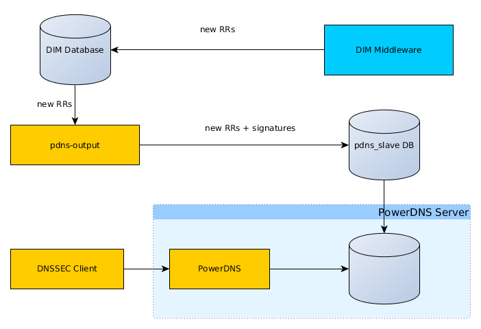

.. _administrator:

===========================
Administrator Documentation
===========================

dim provides three scripts in ``/opt/dim/bin``:

* manage_db
* manage_dim
* report

manage_dim
==========

manage_dim set_user
-------------------

Set an user's type to either Admin (full access, regardless of rights granted)
or User (access based on the rights granted).

manage_dim rebuild_tree
-----------------------

Rebuilding the tree is an operation that recomputes the values for the
*ipblock.parent* column. This it is useful to ensure the consistency of the ip
tree. If any inconsistencies are detected, a warning is written in the log.

manage_dim sync_ldap
--------------------

Synchronizes user group names and users for groups that have the ``ldap_base`` and ``ldap_filter``
attributes set.

If two departments end up having the same name, one of them will have the id appended to the name to
form a unique user group name.

.. _manage_dim update_validity:

manage_dim update_validity
--------------------------

Checks for signed zones with less than half of the validity window left and increases the validity period.

manage_dim autodns3
-------------------

Daemon that runs the autodns3 registrar actions started by users.

report
======

report update_history
---------------------

This command collects information required for *report pool*. This command
must be run daily from cron.

report pool
-----------

The template file used formatting the report contains a `Python format string
<http://docs.python.org/release/2.6.7/library/string.html#formatstrings>`_. It
uses the following variables:

- *pool_name*
- *objects* -- a string containing the object type (``IPs`` or ``/prefix
  blocks`` if the pool was followed by a prefix)
- *interval_1*, *interval_2*, *interval_3* -- the intervals (in days), currently
  hardcoded to 1, 7, 30
- *usage_1*, *usage_2*, *usage_3* -- the number of objects used in the
  corresponding interval
- *current_free* -- the number of currently free objects in this pool
- *prediction*

.. note::
   To escape curly braces (``{`` or ``}``) they must be doubled (``{{`` or ``}}``).
   For example, to include ``{noformat}`` in the report, the template must
   contain ``{{noformat}}``.

report usage
------------

dim-bind-file-agent
===================

This script will create the necessary BIND zone files and a BIND include file
for an output with plugin type *bind*. It comes in a separate Debian package and
is intended to be run from cron on the BIND server machine.

An authenticated dim user is needed with the *dns_update_agent* right.

dim-bind-file-agent will and rewrite only the zone files for zones that have
pending updates. After a successful run, the pending updates will be removed.

For command line parameters please see ``dim-bind-file-agent -h``.

.. warning:: Any file not generated by dim-bind-file-agent from the zone file
   directory will be deleted.

pdns-output.jar
===============

The pdns output module requires JDK 8. It can be started by::

    java -jar /opt/dim/pdns-output.jar [--config <path_to_config_file>]

The configuration file is a standard Java properties file. The configuration options starting with
``db.`` are passed to the JDBC datasource (without the ``db.`` prefix).

DNSSEC
======

Zone singning is handled by pdns-output. This means RRSIG records don't clutter the zone data visible
with normal dim API calls. The keys are only stored in the dim database.

To enable DNSSEC for a zone simply use ``ndcli modify zone <z> dnssec enable`` and make sure the
zone is present in any ``pdns-db`` output.

``manage_dim update_validity`` needs to run periodically in order to ensure that the validity window stays up-to-date.
The validity window can be configured per zone by setting the ``dnssec_validity_window`` attribute (validity window
in seconds).

.. _autodns3:

autodns3 registrar
==================

The updates to the autodns3 registrar are handled by ``manage_dim autodns3``.

To add a zone's DS records to the registrar, first add the zone to the registar-account with
``ndcli modify registrar-account <> add zone <>``.

Running ``ndcli list zone <> registrar-actions`` displays the ongoing registrar action if it exists
and a pending action if the registrar DS record set is not up-to-date.

The update of the DS record set can be started with ``ndcli modify zone <> run-registrar-actions``.

To check the result of the last action for each zone added to a registrar-account
run ``ndcli list registrar-account RA zones -t -v``.

.. warning:: autodns3 deletes messages that are not polled in 24 hours. ``manage_dim autodns3`` automatically
   marks actions started for more than 24 hours as *unknown*.

Apache configuration
====================

Instructions for CentOS 7:

1. Edit ``/etc/dim/dim.cfg``.

2. Install the necessary httpd modules::

    yum install mod_ssl mod_wsgi

3. Adjust the hostname in the ``Redirect`` directive and the SSL configuration
   from ``/etc/httpd/conf.d/dim.conf``.

4. The default SELinux rules disallow httpd from opening connections. Since dim
   runs in httpd's context, this prevents it from connecting to LDAP for
   authentication or to the autodns3 API. To fix this problem run::

    setsebool -P httpd_can_network_connect=on

5. Finally restart apache::

    apachectl restart
